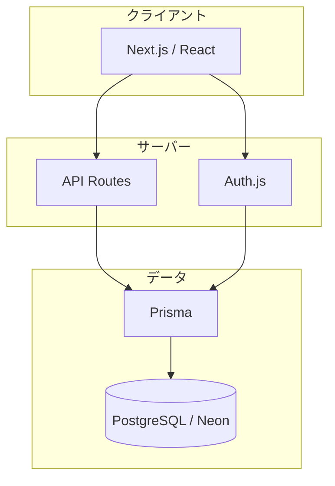
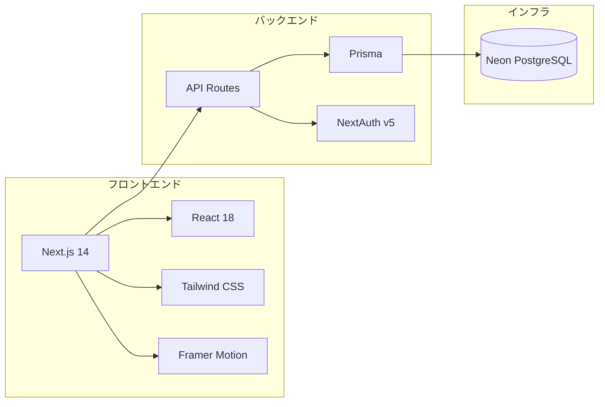

# Mission Manager Web

<p align="center">
  <strong>ジャンル × ミッション × タスク</strong> — 3階層で管理するタスク管理Webアプリケーション
</p>

<p align="center">
  <a href="https://mission-manager-web.vercel.app/">🌐 アプリを開く</a>
</p>

<p align="center">
  <a href="#機能">機能</a> •
  <a href="#技術スタック">技術スタック</a> •
  <a href="#アーキテクチャ">アーキテクチャ</a> •
  <a href="#設計のポイント">設計のポイント</a> •
  <a href="#セットアップ">セットアップ</a>
</p>

---

## 概要

**Mission Manager Web** は、プロジェクトを「ジャンル → ミッション → タスク」の3階層で整理し、進捗を可視化しながら管理できるWebアプリです。デスクトップ版 [MissionManager](https://github.com/RintaroYamaoka/MissionManager) のWeb版として開発しています。

### こんな方に向いています

- 複数プロジェクト（学習、仕事、趣味など）を一括管理したい
- 期限に応じた自動並び替えで、今やるべきことが一目でわかるようにしたい
- ミッション単位の進捗をプログレスバーで確認したい

---

## 技術スタック

| カテゴリ | 技術 |
|----------|------|
| **フロントエンド** | Next.js 14 (App Router), React 18, Tailwind CSS, Framer Motion |
| **バックエンド** | Next.js API Routes |
| **データベース** | PostgreSQL (Neon) |
| **ORM** | Prisma |
| **認証** | Auth.js (NextAuth v5) — メール・パスワード認証 |

---

## 機能

- **3階層管理** — ジャンル / ミッション / タスクの CRUD
- **概要（summary）** — 各階層に説明文を追加可能
- **進捗バー** — ミッション内タスクの完了率をリアルタイム表示
- **期限管理** — タスク・ミッションに期限を設定し、期限が近い・未完了のものが上に自動表示
- **楽観的更新** — チェックボックス操作後、サーバー待ちなしで即時UI更新
- **右クリックメニュー** — 名前変更、概要編集、期限編集、上へ/下へ移動、削除（期限・完了状況が同じ項目間のみ移動可、違う場合は「期限が優先されます」と表示）
- **レスポンシブ** — PC・スマホに対応

---

## アーキテクチャ

### システム構成



### ディレクトリ構造

```
MissionManagerWeb/
├── app/                    # Next.js App Router
│   ├── api/                # API ルート
│   │   ├── auth/           # 認証（NextAuth, 新規登録）
│   │   ├── genres/         # ジャンル CRUD・移動
│   │   ├── missions/       # ミッション CRUD・移動・タスク一覧
│   │   └── tasks/          # タスク CRUD・移動
│   ├── login/
│   ├── register/
│   ├── layout.tsx
│   └── page.tsx
├── components/             # PageContent, GenreSelector, MissionCard, TaskItem など
├── hooks/                  # useGenres
├── lib/                    # db.ts (Prisma), types.ts
├── prisma/                 # schema.prisma
├── auth.ts / auth.config.ts
└── middleware.ts           # 認証ガード
```

### 主要な依存関係



### 設計のポイント

| 観点 | 内容 |
|------|------|
| **責務の分離** | `Page` → `PageContent` → カスタムフック → コンポーネント の流れで、どこで何を担当しているかが明確 |
| **データ取得の集約** | `useGenres` でジャンル一覧の取得・更新・楽観的更新を一元管理 |
| **RESTful API** | ジャンル / ミッション / タスクの CRUD が一貫したエンドポイント構成 |
| **認証スコープ** | middleware でルート保護し、各 API で `userId` によるデータアクセス制御 |
| **楽観的更新** | チェックボックス操作を即座に UI に反映し、UX を重視 |
| **N+1 回避** | Prisma の `include` で Genre → Mission → Task を一括取得 |
| **型安全性** | TypeScript + Prisma によるエンドツーエンドの型保証 |

---

## セットアップ

### 必要要件

- Node.js 18+
- PostgreSQL（[Neon](https://neon.tech) 推奨）

### 1. クローン & インストール

```bash
git clone https://github.com/RintaroYamaoka/MissionManagerWeb.git
cd MissionManagerWeb
npm install
```

### 2. 環境変数

`.env.example` をコピーして `.env` を作成し、値を設定してください。

```bash
cp .env.example .env
```

| 変数名 | 説明 |
|--------|------|
| `DATABASE_URL` | プール接続URL（Neon の Connection string） |
| `DIRECT_URL` | 直接接続URL（マイグレーション用） |
| `AUTH_SECRET` | `npx auth secret` で生成 |

### 3. データベース初期化

```bash
npx prisma generate
npx prisma db push
```

### 4. 起動

```bash
npm run dev
```

→ http://localhost:3000 でアクセス

---

## ライセンス

MIT
